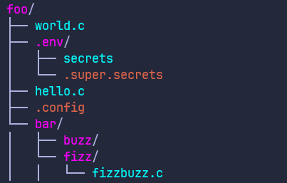

# DirVis 🌳

**Directory Visualiser** - A fast, simple command-line tool for visualising directory structures with tree output.

## Usage

```bash
dirvis [DIRECTORY] [OPTIONS]
```

#### Arguments
- `DIRECTORY` - Path to the directory to visualise

#### Options
- `--show-hidden` - Include hidden files and directories in output
- `--max-depth <N>` - Limit directory traversal to N levels deep
- `--no-colour` - Use default colours (white) when printing
- `--help` - Display help information

## Examples

### Basic Usage
Visualise the ```foo``` directory:
```bash
dirvis foo
```
```
foo/
├── world.c
├── hello.c
└── bar/
    ├── buzz/
    └── fizz/
        └── fizzbuzz.c
```

### Show Hidden Files
Include hidden files and directories in the output:
```bash
dirvis foo --show-hidden
```
```
foo/
├── world.c
├── .env/
│   ├── secrets
│   └── .super.secrets
├── hello.c
├── .config
└── bar/
    ├── buzz/
    └── fizz/
        └── fizzbuzz.c
```

### Limit Depth
Control how deep the tool traverses subdirectories:
```bash
dirvis foo --show-hidden --max-depth 2
```
```
foo/
├── world.c
├── .env/
│   ├── secrets
│   └── .super.secrets
├── hello.c
├── .config
└── bar/
    ├── buzz/
    └── fizz/
```

### Color Output 
If a dirvis.ini file can be opened, output will be colorised:
```bash
dirvis foo --show-hidden
```

## Roadmap
- [ ] Specify directories to exclude from recursion
- [x] Config file to change primary/accent colours
- [ ] Add some information like file size and date created to output
- [ ] Exclude printing things like 'node_modules' folders
- [ ] Add a default depth or other output control to prevent huge prints when used without depth flag
- [ ] Change spelling of 'colour' to 'color' (damn Americans...)
- [ ] Clean up codebase because it's disgusting
- [ ] Write some completion scripts for autocomplete functionality


